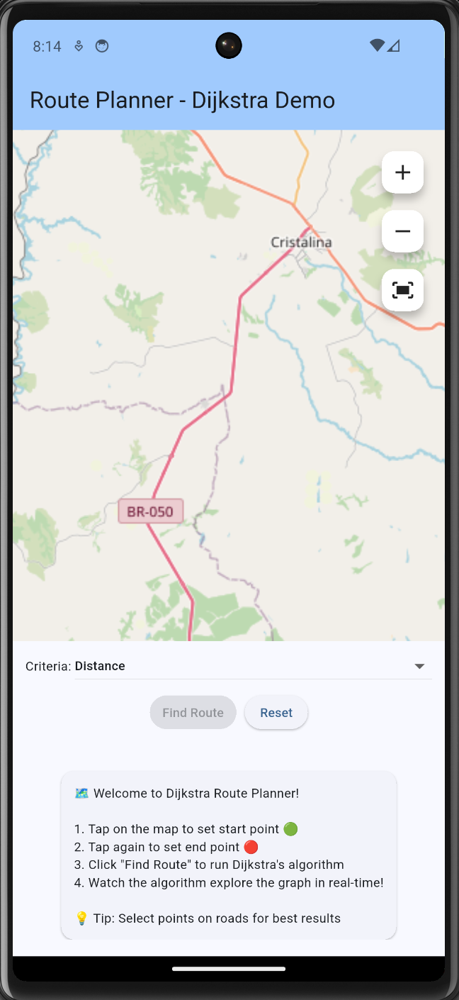
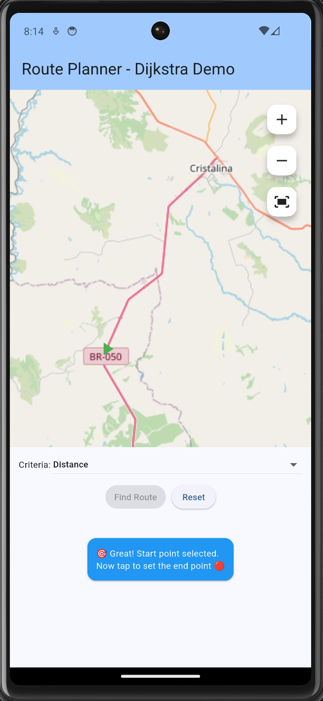
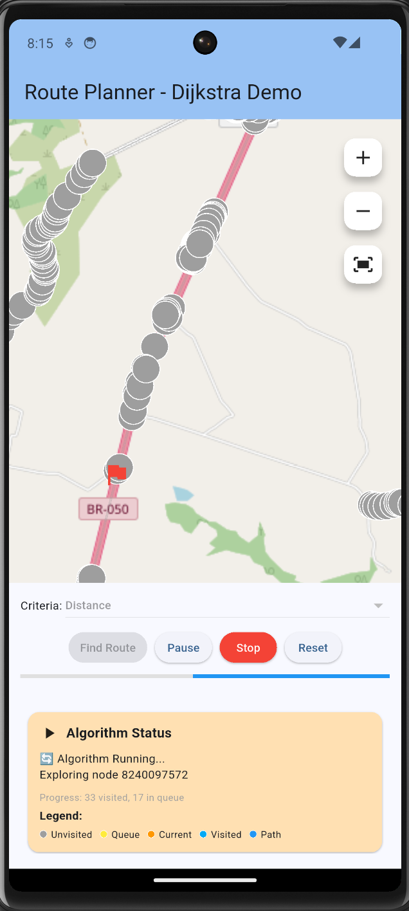
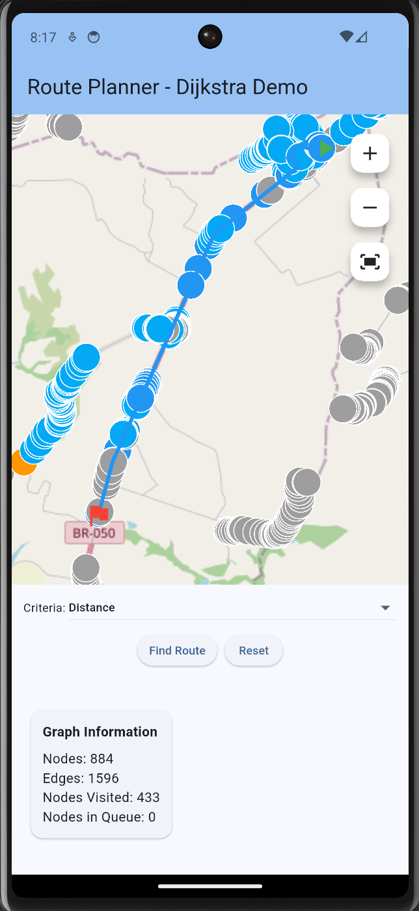
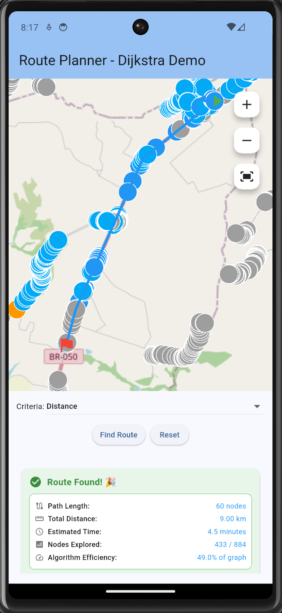
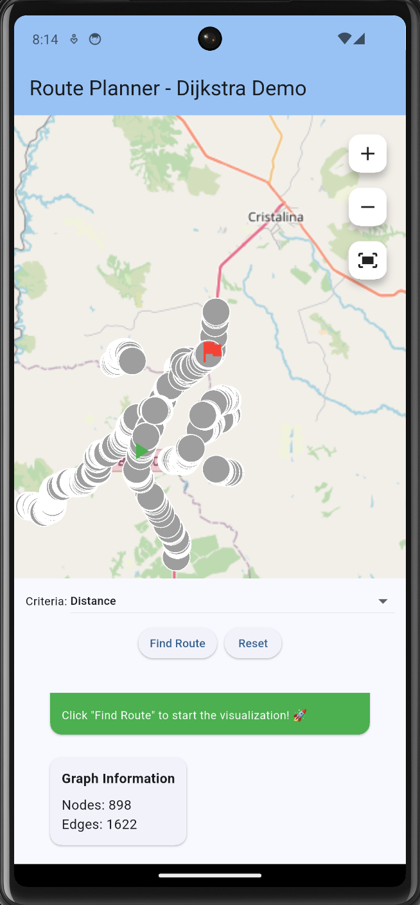

# Trabalho 2 - Grafos 2

**Número do trabalho:** 2  
**Conteúdo da Disciplina: Grafos**

## Alunos

| Matrícula |          Nome Completo           |
| :-------: | :------------------------------: |
| 200041959 | Mauricio Machado Fernandes Filho |
| 221008202 | José Eduardo Vieira do Prado     |

## Descrição 
O trabalho de grafos 2 está divido em dois seguimentos, um projeto que implementa um **Planejador de Rotas com Visualização do Algoritmo de Dijkstra** utilizando dados reais do OpenStreetMap (OSM) e dois [Exercícios do LeetCode](#exercícios-LeetCode) (1 médio e um difícil)

## Descrição do Projeto

Este projeto implementa um **Planejador de Rotas com Visualização do Algoritmo de Dijkstra** utilizando dados reais do OpenStreetMap (OSM). O objetivo é demonstrar visualmente como o algoritmo de Dijkstra encontra o caminho mais curto entre dois pontos em uma rede rodoviária real, proporcionando uma experiência educativa e interativa.

O sistema permite que os usuários selecionem pontos de origem e destino em um mapa interativo e observem em tempo real como o algoritmo de Dijkstra explora o grafo de ruas para encontrar a rota ótima.

## Tecnologias Utilizadas

### Frontend e Interface

- **Flutter** - Framework multiplataforma para desenvolvimento da aplicação
- **Dart** - Linguagem de programação principal
- **flutter_map** - Widget para renderização de mapas interativos

### Dados e APIs

- **OpenStreetMap (OSM)** - Fonte dos dados de mapeamento
- **Overpass API** - API para consulta de dados OSM estruturados

### Algoritmos e Estruturas de Dados

- **Algoritmo de Dijkstra** - Implementação com visualização em tempo real
- **Grafos Ponderados** - Estrutura de dados para representar a rede rodoviária
- **Priority Queue** - Implementação customizada para otimização do algoritmo

## Funcionalidades Principais

### 🗺️ **Mapa Interativo**

- Visualização de mapas baseados em OpenStreetMap
- Controles de zoom (in/out/fit) para navegação
- Seleção de pontos de origem e destino por toque
- Renderização em tempo real do grafo de ruas

### 🚀 **Algoritmo de Dijkstra Visualizado**

- Animação passo-a-passo do algoritmo em execução
- Codificação por cores dos estados dos nós:
  - **Cinza**: Nós não visitados
  - **Amarelo**: Nós na fila de prioridade
  - **Laranja**: Nó sendo processado atualmente
  - **Azul claro**: Nós já visitados
  - **Azul escuro**: Caminho ótimo final

### ⚙️ **Critérios de Otimização Configuráveis**

- **Distância**: Menor distância física
- **Tempo**: Menor tempo de viagem estimado
- **Prioridade de Rodovia**: Preferência por vias principais

### 📊 **Análise de Performance**

- Estatísticas do algoritmo em tempo real
- Métricas de eficiência e cobertura do grafo
- Informações detalhadas da rota encontrada
- Sistema de logs abrangente para debug

### 🔍 **Detecção Inteligente de Conectividade**

- Verificação prévia de conectividade entre pontos
- Seleção inteligente de nós com conexões ativas
- Feedback claro para casos onde não há rota possível

## Screenshots da Aplicação

### Tela Inicial
A interface inicial da aplicação com o mapa interativo pronto para seleção de pontos.

### Seleção de Ponto de Origem
Após selecionar o primeiro ponto (origem), o sistema aguarda a seleção do destino.

### Algoritmo em Execução
Visualização em tempo real do algoritmo de Dijkstra explorando o grafo de ruas com estatísticas detalhadas.

### Rota Encontrada - Interface
Interface da aplicação mostrando a rota encontrada destacada no mapa.

### Rota Encontrada - Estatísticas
Painel de informações detalhadas sobre a rota encontrada e performance do algoritmo.

### Visualização da Rota Selecionada
Vista completa da rota selecionada com todos os nós e arestas do caminho ótimo.

## Arquitetura do Sistema

### **Camada de Dados**

- **OSMService**: Integração com Overpass API para busca de dados
- **RouteGraph**: Estrutura de dados para representação do grafo
- **GraphEdge**: Modelagem de arestas com pesos customizáveis

### **Camada de Algoritmos**

- **DijkstraAlgorithm**: Implementação com capacidades de visualização
- **PriorityQueue**: Estrutura de dados otimizada para o algoritmo
- **ConnectivityChecker**: Verificação de conectividade do grafo

### **Camada de Interface**

- **RoutePlannerScreen**: Tela principal da aplicação
- **RouteMapWidget**: Componente de mapa com sobreposição de dados
- **AlgorithmControls**: Controles para execução do algoritmo
- **RouteInfoPanel**: Painel informativo com feedback em tempo real

## Como Executar

### Pré-requisitos

- Flutter SDK instalado
- Conexão com internet para acesso aos dados OSM

### Instruções

1. Clone este repositório
2. Navegue até a pasta `route_planner`
3. Execute `flutter pub get` para instalar dependências
4. Execute `flutter run` para iniciar a aplicação

## Uso da Aplicação

1. **Seleção de Pontos**: Toque no mapa para definir origem (🟢) e destino (🔴)
2. **Configuração**: Escolha o critério de otimização desejado
3. **Execução**: Clique em "Find Route" para iniciar o algoritmo
4. **Visualização**: Observe a animação do algoritmo explorando o grafo
5. **Análise**: Examine as métricas e informações da rota encontrada

## Aspectos Educacionais

Este projeto serve como uma ferramenta educacional para:

- Compreensão visual do algoritmo de Dijkstra
- Aplicação prática de conceitos de grafos
- Demonstração de otimização de rotas em cenários reais
- Análise de performance algoritmica
- Integração de dados geoespaciais em aplicações

## Vídeo Demonstrativo

🎥 [Assista ao vídeo demonstrativo do projeto](https://youtu.be/fRfn1Qh_alA)

## Linguagens Utilizadas

- **Dart** - Linguagem principal do projeto

# Exercícios LeetCode 

### Exercício 01 - Médio

[1584.MinCostToConnectAllPoints](https://leetcode.com/problems/min-cost-to-connect-all-points/submissions/1778382634)

[Vídeo Solução Exercício 1](link-aqui)

### Exercício 02 - Difícil

[924.MinimizeMalwareSpread](https://leetcode.com/problems/minimize-malware-spread/submissions/1778510745)

[Vídeo Solução Exercício 2](link-aqui)
